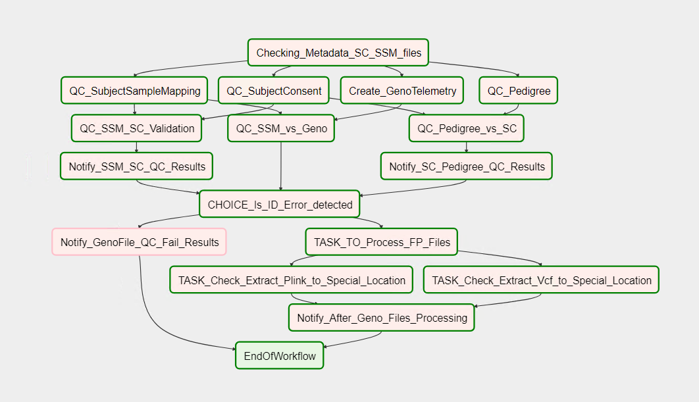

# GapTools
The National Center for Biotechnology Information's [dbGaP archive](https://www.ncbi.nlm.nih.gov/gap/) has processed, archived and distributed genome scale datasets from over 1500 different studies comprised from data collected on over 2 million study participants (subjects) since 2007. In support of National Institutes of Health [Genomic Data Sharing policy](https://osp.od.nih.gov/scientific-sharing/genomic-data-sharing/) and the emerging NIH data sharing ecosystem the NCBI has developed a QA/QC software tool named GapTools  to evaluate consistency of genome scale datasets. This tool is used to evaluate datasets prior to submission to public archives, such as dbGaP. This software package uses the same code and therefore is consistent with the code for the internal dbGaP automated processing pipeline. The tool is intended to identify common inconsistencies that can delay processing/sharing of the data. The use of this tool and correcting any errors prior to submission will substantially reduce the time needed for dbGaP staff to process and release data. This tool is not designed for genomic analysis. GapTools is distributed as a docker image on Dockerhub.

#### Why Docker?
GapTools uses Apache Airflow behind the scenes as the workflow orchestrator to perform all the validation tasks. Apache Airflow is a platform to programmatically author, schedule and monitor workflows. Workflows are authored as directed acyclic graphs (DAGs) of tasks. The airflow scheduler executes tasks on an array of workers while following the specified dependencies.    

There are four main components of Apache Airflow:
* A metadata database for tasks
* UI web client for monitoring task execution
* A scheduler that triggers tasks
* An executor (worker) that gets the tasks done

Though all the above components can be setup independently, we use Docker to reduce the overhead of setup and configuration of the individual components. All these components are defined and configured in a single docker-compose file, which is used to bring up all the components with a single command.

#### Current QC Checks
The initial release of GapTools includes the functions to check the issues that most commonly cause delays in processing and prevent data archiving and sharing via dbGaP, including:
* Basic file identifier formatting
* Consistency of subject (person) ids and sample (aliquot) ids
* Pedigree (family) file integrity 
* Consistency of Genomic data to reported: 
    * Subject and Sample IDs
    * Sex
    * Relationships

#### Required Files
GapTools is designed to check core phenotype data files and genomic datasets in both [PLINK](https://www.cog-genomics.org/plink/1.9/formats) and [VCF](https://en.wikipedia.org/wiki/Variant_Call_Format) format. To review the required files and their format for individual level data submission please see the [dbGaP submission guide](https://www.ncbi.nlm.nih.gov/gap/docs/submissionguide/). 

##### Metadata file

This tool also requires as an input parameter, a json file with the metadata information about the files to be processed. The file has to be named `metadata.json`. 

Here is a sample `metadata.json` file:
```
{
  "NAME": "1000 Genomes Public Study",
  "FILES": [
    {
      "name": "1000_Genomes_SC.txt",
      "type": "subject_consent_file"
    },
    {
      "name": "1000_Genomes_SSM.txt",
      "type": "subject_sample_mapping_file"
    }
  ]
}

``` 

The metadata file, at the very minimum, requires the following attributes:

* A `NAME` attribute that describes the study being processed
* A `FILES` attribute that contains information about the 2 required files:
    * `subject_consent_file`
    * `subject_sample_mapping_file`

An optional file of type `pedigree_file` can also be added to the `FILES` list in the metadata file.

#### Usage
Please refer to the [README](README.md) file for instructions to setup and execute GapTools.

#### Check Processing Status
Once GapTools is triggered to process the files, the status of the workflow execution can be checked by browsing to the URL below:
```
http://<docker_host_ip>:8080/admin/airflow/graph?dag_id=GapTools
```
The URL opens the embedded Airflow UI web console that displays the status of the DAG execution. Here is an example of a DAG that has successfully finished processing:



 #### Airflow DAG Task Definitions

* `Checking_Metadata_SC_SSM_Files` - Validates the structure of the metadata.json file. It also checks the metadata file has all the required attributes.
* `Create_GenoTelemetry` - Creates a telemetry file for subsequent tasks to refer to.
* `QC_Pedigree` - Validates the Pedigree file (if present) for any errors. Does nothing if Pedigree file is not provided.
* `QC_SubjectSampleMapping` - Validates the Subject Sample Mapping file for any errors. 
* `QC_SubjectConsent`- Validates the Subject Consent file for any errors.
* `QC_SSM_vs_Geno` - Compares the Subject Sample Mapping and Geno Telemetry files and reports any errors.
* `QC_Pedigree_vs_SC` - Compares the Pedigree and Subject Consent files and reports any errors. Does nothing if the Pedigree file is not provided.
* `QC_SSM_SC_Validation` - Compares the Subject Consent and Subject Sample Mapping files and reports any errors.
* `Notify_SC_Pedigree_QC_Results` - Generates a consolidated report of the results of comparing the Subject Consent and Pedigree files. Does nothing if the Pedigree file is not provided.
* `Notify_SSM_SC_QC_Results` - Generates a consolidated report of the results of comparing the Subject Sample Mapping and the Subject Consent files.
* `CHOICE_Is_ID_Error_detected` - Checks if any ID errors are detected from the above validation tasks.
* `Notify_GenoFile_QC_Fail_Results` - Generates a consolidated report if any ID errors are detected. Proceeds directly to the `EndOfWorkflow` task.
* `TASK_TO_Process_FP_Files` - Executed when no ID errors are detected.
* `TASK_Check_Extract_Vcf_to_Special_Location` - Extract VCF files to a location in the output directory.
* `TASK_Check_Extract_Plink_to_Special_Location` - Extract PLINK files to a location in the output directory.
* `Notify_After_Geno_Files_Processing` - Generates a consolidated report of the processing of Geno files.
* `EndOfWorkflow` - Marks the end of the worflow.
  
#### Output Files
At the end of all the validation tasks, GapTools generates reports in the specified output directory. It produces consolidated reports written to a file in an email format under the `<output_dir>/client_emails/studies/` directory.

GapTools also generates individual reports in JSON format for every task in the Airflow DAG. These individual reports are created under `<output_dir>/geno/client_message` and `<output_dir>/pheno/data/qc` directories.

